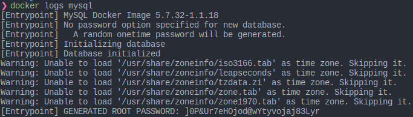
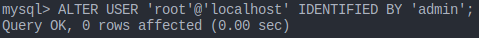

# NestJS tutorial

## Todos

- [x] 프레임워크 기본적인 사용과 타입스크립트 경험
- [x] ~~MySQL /w Prisma~~ -> SQLite /w Prisma로 변경
- [ ] GraphQL
- [ ] Message queue (Kafka? ZMQ? RabbitMQ?) 

## TIL

> 2020.12.23

기존의 *Node.js* 웹 백엔드 프레임워크들은 구조가 정해져있지 않았다. 가장 대표적인 Express.js는 router만 준다. boilerplate같은 best practices를 보면 SRP 원칙을 적용하려 router와 controller를 알아서 나누어서 사용했다. router는 요청이 들어올 주소나 parameter를 정의하고, controller에서 비즈니스 로직을 처리했다. 예를들어 아래와 같다.

```
routers
ㄴ index.js
  ㄴ users
    ㄴ index.js (router, import controller)
    ㄴ users.controller.js
  ㄴ boards
    ㄴ index.js
    ㄴ boards.controller.js
  ㄴ auth
  ㄴ ...
```

반면에 `NestJS`는 *Spring*이나 *Django* 같은 프레임워크에서 볼 수 있는 **DI(Dependency Injection)** 가 적용되어있다. DI는 사용하는 객체를 직접 생성하지 않고 *비즈니스 로직을 처리하는 클래스의 생성자를 사용하여 처리*한다. 이로 인해 얻는 장점은 코드간 **낮은 결합도**를 유지할 수 있다는 점이다.

```
main.ts           (실제 웹서버 bootstrap)
app.module.ts     (module import 수행. 아래의 user, auth... 등)
app.service.ts    (business logic 수행)
app.controller.ts (router 역할 수행)
users
ㄴ dto
  ㄴ create-user.dto.ts
  ㄴ update-user.dto.ts
ㄴ model
  ㄴ user.model.ts
ㄴ users.module.ts    
ㄴ users.service.ts
ㄴ users.controller.ts
auth
ㄴ auth.module.ts
ㄴ auth.service.ts
ㄴ auth.controller.ts
...
```

NestJS는 generator로 템플릿을 만들 때 부터 controller(Routing)와 service(process business logic)를 시작부터 철저하게 분리한다. 또한 *DTO(Data Transfer Object)*, 데이터를 사용할 때 정의하는 일종의 인터페이스를 정의함으로써 협업하는 조직의 실수를 줄여줄 수 있다.

계속 언급하는게 **실수를 줄이고, 결합도를 낮춘다**이다. 개발은 혼자 하는게 아니다. 전체적인 실수를 줄이면 디버깅 시간이 줄어들고, 코드 결합도를 낮추면 코드에 문제가 발생하거나 구조를 개선할 때 빠른 피드백을 기대할 수 있다.

하루동안 가지고 놀면서 가장 유용했던 점을 3줄 요약하면

1. 타입스크립트의 **타입 체크**
2. 자바스크립트에서 볼 수 없었던 **코드 힌트(실수 줄이기)**
3. **코드 린트**
4. `nest g controller/module/service ...` 

> 2020.12.24

Unit testing 및 e2e testing 추가

MySQL 추가

`Mongo`만 쓰다가 `MySQL` 쓰려니 많이 헷갈렸다. 디비같은 시스템 인프라는 잘못 건드렸을 때 힘들어서 개발 환경을 왠만하면 도커로 사용하려는데, 아직 미숙해서 기본적인 것임에도 불구하고 삽질을 했다.



MySQL에서 `MYSQL_ROOT_PASSWORD`를 지정하지 않았을 때는 mysql log를 보고 쓰자.

그리고 안에서 바꾸자. 비밀번호를 admin으로 바꿨다.



> 2020.12.25

인증을 위해 JWT 도입. 앞으로 인증은 JWT를 통해서 인증된 유저만 서비스를 사용할 수 있도록 미들웨어를 수정해야한다.

특이하게도 `auth.service.ts`의 **validateUser**가 **login**을 실행할 때 먼저 실행된다.(호출은 하지 않았다) 아마 NestJS에서 `UseGuards` 데코레이터를 사용한다.

```ts
// auth.controller.ts
@Post('login')
@UseGuards(LocalAuthGuard)  /* 가드를 사용 */
async login(@Request() req) {
  return this.authService.login(req.user);
}
```

이 때 `LocalAuthGuard`이 계정 존재 여부를 확인하는 함수(validateUser)를 실행하므로, 자동으로 호출 스택이 만들어지는 것으로 추정된다. 데코레이터가 익숙해지면 정말 편한 기능이겠지만 아직 잘 모를 때는 함수 호출 스택을 코드로 따라가는데 한계가 있다보니 찾는데 좀 걸렸다.

> 2020.12.27

Guard 데코레이터의 동작 원리를 알아보기위해 로그를 찍어봤는데, 순서는 아래와 같았다.

0. 서버로 POST /auth/login 요청 들어옴
1. local.strategy - validate
2. Authservice - validateUser
3. UsersService - findByName(DB query)
4. AuthService - login 서비스
5. AuthController - login 함수, JWT 반환

즉 Controller에 Guard 데코레이터를 얹으면 해당 로직이 먼저 수행된다.

---

이전에 NestJS는 DI패턴을 사용한다고 했었다. [Custom-providers](https://docs.nestjs.com/fundamentals/custom-providers) 를 보면 좀 더 자세히 나와있다.

NestJS에서 `DI`, 종속성 주입은 `IoC(Inversion of Control)`을 기반으로 한다. 문서에서는 **고유적인 코드를 명령형으로 수행하는 것이 아닌 IoC 컨테이너(NestJS 런타임)에 종속성을 인스턴스화(생성자)하여 위임한다**고 적혀있다. 종속성을 주입하는 클래스를 NestJS에서 `provider`라 한다. 코드레벨에서 작성하는 방법은 아래의 프로세스를 거친다.

1. 의존성 주입이 가능한 클래스를 작성한다.(`@Injectable()`데코레이터를 가진 클래스. 대표적으로 service)
2. 해당 provider를 다른 클래스에서 위임받아(import) 사용한다. 이 때, 생성자에 해당 provider를 생성자로 멤버변수에 정의하고 사용한다.
3. NestJS가 의존성을 확인할 수 있도록 xxx.module.ts의 @Module() 데코레이터 중 종속성을 주입하는 클래스를 provider에 작성한다.

`@Module()` 데코레이터에서 providers를 정의하는 것은 축약형으로 사용하는 방법이라 설명한다. 사실은 아래처럼 더 세부적으로 나눌 수 있다.

```js
providers: [
  {
    provide: AuthService,
    useClass: AuthService
  }
]
```

축약형으로 사용하는 것이 가장 일반적인 사용법을 단순화할 수 있는 방법이고, 실제로 토큰(provide와 useClass)은 클래스의 인스턴스를 같은 이름으로 요청하기 때문이다.

하지만 이와같은 경우 커스텀 provider를 사용할 수 있다.

- NestJS에서 제공하는 인스턴스화된(또는 캐시된) 클래스 대신 커스텀 인스턴스를 사용하기 위해
- 존재하는 클래스에서 중첩 의존성을 재사용하기 위해
- 테스트를 위해 모킹한 클래스를 오버라이드 하기 위해

지금부터는 `@Module()` 데코레이터에서 사용할 수 있는 값들을 나열해본다.

`useValue`: 상수값을 주입하기 위해 사용한다. 외부 라이브러리나 모킹 오브젝트를 Nest 컨테이너에 넣는 방식을 사용한다. 

`useClass`: 동적으로 클래스를 결정할 때 유용하다. 예를들어 배포 환경변수에 따라 클래스를 다르게 할 수 있다. 

```js
const configServiceProvider = {
  provide: ConfigService,
  useClass: process.env.NODE_ENV === 'production' ? ProductionConfig : DevelopmentConfig
}

@Module({
  providers: [configServiceProvider],
})
```

`useFactory`: Provider를 동적으로 생성할 수 있게 해준다. 실제로 주입될 종속성 provider는 factory function의 반환값에 의해 결정된다. Factory function은 다른 provider들과 아무런 관계(종속성)이 없을 수도 있고, 여러 종속성을 가질 수 있다. 각각의 경우 `simple factory`, `complex factory`라 한다. 

```js
const connectionFactory = {
  provide: 'CONNECTION',
  useFactory: (optionsProvider: OptionsProvider) => {
    const options = optionsProvider.get();
    return new DatabaseConnection(options);
  },
  inject: [OptionsProvider],
};

@Module({
  providers: [connectionFactory],
})
```

`useExisting`: Provider의 alias를 사용할 수 있다.

```js
const loggerAliasProvider = {
  provide: 'AliasedLoggerService',
  useExisting: LoggerService,
};

@Module({
  providers: [LoggerService, loggerAliasProvider],
})
```

---

다음으로는 NestJS에서 **Configuration**에 대해 알아보려한다. 우리는 여러가지 환경에서 런타임을 돌린다. 개발, 테스트, 프로덕션 등 여러가지 환경이 존재한다. 각각 세팅을 맞춰야하는데 이는 하드코딩, 파일로 관리, 환경변수로 관리 등이 있다. 가장 간편하고 익숙한 방법은 **환경변수로 관리하는 방법**이다.

특히 Node.js 에서는 `process.env` global 변수를 사용하는데, 일반적으로 `.env`파일에 환경변수들을 적고 `dotenv`모듈을 사용하여 읽어와 사용한다. 필요에 따라 적절한 .env파일을 읽어와 처리하면된다.

NestJS에서는 `ConfigModule`의 `ConfigService`를 사용하여 적절한 .env파일을 로드하도록 권장한다. `@nestjs/config` 패키지를 설치하면 사용할 수 있다. 참고로 이는 dotenv를 포함하는 패키지이므로, 중복설치 하지 않아도 된다. .env 파일을 파싱하여 K-V값들을 로드하여 process.env 에 저장한다.

```js
ConfigModule.forRoot({
  envFilePath: '.development.env',  // 이름 .env가 아닌 환경변수 파일 1개
  // envFilePath: ['.dev.env', '.prod.env'], // 환경변수 파일 2개 이상
  isGlobal: true     // 전역적으로 선언하여 다른 모듈에서 import 하지 않아도 됨
  cache: true       // 캐싱
  expandVariables: true   // dotenvExpand 사용
});
```
#### 참고
- envFilePath를 지정하지 않으면 **root 디렉토리의 .env 파일을 사용**한다.
- 쉘 변수 export와 환경변수가 동시에 존재할경우, **환경변수를 사용**한다.
- 만약 두 파일의 환경변수가 동시에 존재하면 **첫번째(.dev.env) 환경변수**를 따른다.

다음은 파일로 관리하는 방법을 서술한다.

```js
// config/config.ts
export default () => ({
  port: parseInt(process.env.PORT, 10) || 3000,
  database: {
    host: process.env.DATABASE_HOST,
    port: parseInt(process.env.DATABASE_PORT, 10) || 5432
  }
});
```

참고로 `parseInt(STRING, radix)` 이다. radix는 진법을 나타낸다. 10진법을 사용하겠다는 뜻이다. ~~근데 보통 안적더라~~

```js
import config from './config/config';

@Module({
  imports: [
    ConfigModule.forRoot({
      load: [config], // array 이므로 여러 config file을 import 할 수 있다.
    }),
  ],
})
export class AppModule {}
```

> 만약 `.yml` 형식으로 import 하고싶다면 `js-yqml`, `@types/js-yaml`을 설치하면된다.

import를 했으니 사용을 해보자. 

```js
// 1개만 받을 경우
@Get('config')
config(): string {
  const dbUser = this.configService.get<string>('MYSQL_USER');  // 특정 1개
  const dbHost = this.configService.get<string>('DATABASE_HOST', 'localhost') // DATABASE_HOST에서 없으면 localhost 사용
  return dbUser;
}
```

---

`Serialization, 직렬화`는 네트워크나 데이터를 주고받을 때 오브젝트 데이터를 포매팅하는 기법을 말한다. 서버 내부에서 사용하는 민감한 정보는 네트워크를 통해 외부로 유출되면 안된다. NestJS는 `class-transformer` 패키지의 `@Exclude()` 데코레이터를 사용하여 간단하게 직렬화 할 수 있다.

```js
// user.model.ts
export class User {
  id: number;
  name: string;

  @Exclude()    // 해당 데코레이터의 사용으로 모든 클래스에서 
  password: string;

  constructor(partial: Partial<User>) {
    Object.assign(this, partial);
  }
}
```

```js
@Get('serialize')
@Transform(user => user.id)
@SerializeOptions({
  excludePrefixes: ['_'],
})
@UseInterceptors(ClassSerializerInterceptor)
returnOneUser(): UserModel {
  return new UserModel({
    id: 1,
    name: 'taypark',
    password: '1q2w3e4r!', // user model에서 @Exclude() 데코레이터로 인해 password가 제외된다.
    age: 26,
  });
}
```

참고로 **무조건 클래스의 인스턴트를 반환해야**한다. 만약 오브젝트를 반환할 경우 (`{ user: new User() }`) 직렬화가 안된다.
